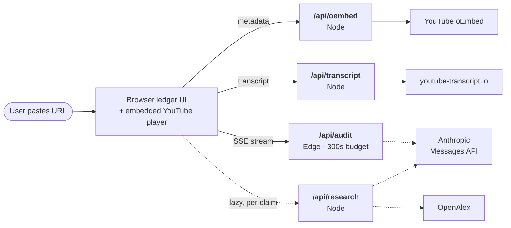
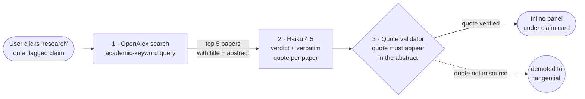

# claim-ledger

> Reads informational video adversarially. Surfaces *the structure of factual claims being made* — instead of summarizing them or fact-checking them.

**Live:** https://claim-ledger-jemsryus-projects.vercel.app/

---

## What it does

Paste a YouTube URL. The auditor:

- **Extracts every factual claim** the speaker makes, with the verbatim quote (Claude Sonnet 4.6).
- **Timestamps each claim word-for-word against the transcript.** The model never emits timestamps — the server fuzzy-matches the verbatim against the real transcript and derives the span deterministically. Claims that don't match are dropped silently.
- **Flags claims adversarially** — `hedged`, `vague-sourced`, `unsourced`, `contradicted`, `un-credentialed` (Claude Haiku 4.5).
- **Generates two verification queries per flagged claim** — an academic-keyword search for Google Scholar, and a natural-language question for Google. One click each.
- **Researches any flagged claim against academic literature on demand.** Click `research` on a claim card — the lens retrieves the top 5 papers from OpenAlex matching the claim, then Claude Haiku judges each as `supports`, `contradicts`, or `tangential`. For supports/contradicts, the model is forced to point to a verbatim sentence from the abstract that justifies the verdict — the server then checks that sentence actually appears in the source and demotes the verdict if not. Every paper links to its DOI. RAG over a public 250M-paper index, no vector DB to maintain, no hallucinated citations.
- **Embeds the YouTube player on the page.** Clicking a timestamp jumps the embedded video in place — no new tab, no context switch.
- **Stays silent on non-informational video.** Paste a music URL, get an explicit "no audit applicable" empty state. The tool knows when it shouldn't speak.

## What it isn't

- **Not an AI summarizer.** It surfaces claim structure, not meaning compression.
- **Not a fact-checker.** It doesn't decide which claims are true — it surfaces *which claims are being made* and *which are unsourced or hedged*, then links you to where you can verify.
- **Not a misinformation classifier.** Adversarial flags are heuristic signals, not verdicts.

---

## System architecture

### Request flow

Four endpoints, different runtimes. `/api/audit` is on Vercel's **Edge** runtime for the 300s streaming budget (Node functions cap at 10s on the free tier, which a real extraction + classification run blows past). `/api/research` is **lazy** — it fires only when the user clicks `research` on a flagged claim, not during the audit itself. The other endpoints stay on Node.

**Transcripts come from `youtube-transcript.io`** — a paid third party that fetches from non-blocked egress. Direct YouTube fetches from Vercel IPs fail 9-of-10 popular videos.

### Audit pipeline (inside `/api/audit`)

Four stages, two of which are deterministic server-side guards (#2 and #4). Each stage's output is the next stage's input; events stream to the client as they're produced.

### Research lens (lazy, per-claim)

This is **RAG (retrieval-augmented generation)** — but with a public API as the retrieval backend rather than a self-hosted vector DB. One OpenAlex call (free, 250M papers indexed) + one batched Haiku call (~$0.0015) per click; latency ~5-10s. Real DOIs, real abstracts, real verdicts the user can verify by reading the source themselves. Never runs at audit time — zero ambient cost unless a user explicitly opts into the deeper read.

Every supports/contradicts verdict carries a verbatim quote from the abstract that the **server checks against the source** (same trust-spine pattern as the timestamp validator — see below). If the model emits a quote that doesn't actually appear, the verdict drops to `tangential` and the quote is removed. The UI separates relevant verdicts (supports/contradicts) from tangential ones: if every retrieved paper is tangential, the panel says so plainly instead of listing five papers labeled "not relevant".

---

## The trust spine

> A wrong timestamp on the first click breaks the product's core promise. Better to under-show than to over-promise.

Four invariants enforced server-side, not trusted to the model:

1. **The model never emits timestamps.** Sonnet returns a verbatim quote; the validator finds the quote in the transcript via fuzzy match and reads the span from the matched segment. If the quote doesn't match (or matches ambiguously across the transcript), the claim is dropped silently.
2. **The matcher uses pigeonhole seeding.** Any match within *k* edits leaves at least one of *(k+1)* disjoint needle seeds untouched in the haystack — so candidate positions come from `String.indexOf` (memchr-speed), and only those positions get banded Levenshtein. ~100× faster than naive scan on long transcripts.
3. **Hedge flags get a locality check.** Haiku tends to flag direct assertions as `hedged` when the speaker hedges *elsewhere* in the transcript. A server-side guard strips `hedged` from any claim whose matched span contains no hedge token. Model emits, server enforces.
4. **Research-lens citations are server-validated.** A `supports` or `contradicts` verdict in the research lens must carry a verbatim quote from the paper's abstract. The server normalizes both sides (lowercase, strip punctuation, collapse whitespace) and verifies the quote actually appears. If it doesn't — the model paraphrased, stitched fragments, or invented evidence — the verdict is demoted to `tangential` and the quote dropped. Same pattern as #1, applied to retrieval.

See [`DESIGN.md`](./DESIGN.md) for the timestamp algorithm in full.

---

## Stack

Next.js 16 (App Router) · React 19 · Tailwind v4 · TypeScript · Anthropic Messages API via raw `fetch` (Sonnet 4.6 + Haiku 4.5) · YouTube oEmbed · `youtube-transcript.io` · OpenAlex (research lens) · Vercel (Edge runtime on `/api/audit`).

No database, no accounts, no persistence beyond a 5-minute in-memory transcript cache. Every audit is computed fresh.

## Design decisions

- **Lens calls bypass the Anthropic SDK.** The SDK transitively imports `node:fs` / `node:path` for its OAuth credential chain, which Vercel's edge function validator rejects on deploy. The lens code calls `https://api.anthropic.com/v1/messages` directly via `fetch`, preserving prompt caching and structured output via `output_config.format`. ~40 lines per lens, fully edge-compatible.
- **Seed-anchored fuzzy matcher** replaced a naive `O(N·W·L²)` brute force in the timestamp validator — on long transcripts the difference is between *minutes* per claim and *milliseconds*. By pigeonhole, any fuzzy match with ≤*k* edits must contain at least one of *k+1* disjoint needle seeds *exactly*, so seeds are found via `String.indexOf` and only those candidate positions run the expensive Levenshtein DP.
- **Server-side hedge-token guard** complements the classifier — Haiku marks claims broadly across the transcript, the server enforces locality against the actual matched span. Same trust-spine pattern as the timestamp validator: model emits, server verifies.
- **Two queries per claim, one per engine.** Scholar gets academic keywords (matches paper titles and abstracts). Google gets a natural-language verification question (Google's question-form ranking surfaces fact-checks, journalism, and explainers). Both generated in the same extraction pass — zero extra API calls.
- **RAG via a public API, not a self-hosted vector DB.** The research lens retrieves real papers from OpenAlex (250M works indexed, free, no key required) and grounds Haiku's verdict in the retrieved abstracts. Vector DBs shine for private corpora; for public academic search, OpenAlex already operates a high-quality retrieval pipeline — building our own would duplicate that work without improving the result. Architecturally simpler (no embedding pipeline, no chunking, no index to maintain), and every cited paper is a real DOI the user can click through.
- **Cited quotes are server-validated against the source.** The research lens forces Haiku to quote the exact sentence from the abstract that justifies its `supports`/`contradicts` verdict, then checks the quote actually appears in the source before showing it. Hallucinated citations are the killer failure mode for RAG products — the validation step makes them structurally impossible to ship to the user. Same trust-spine pattern as the timestamp validator, applied to retrieval.
