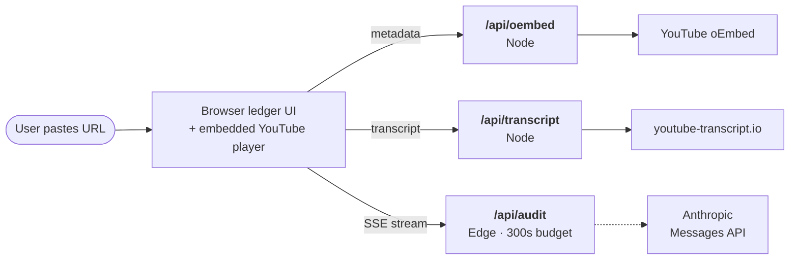
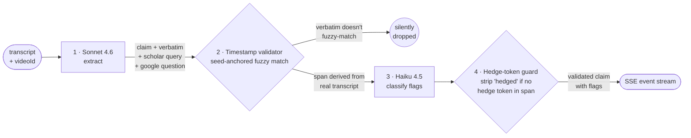

# claim-ledger

> Reads informational video adversarially. Surfaces *the structure of factual claims being made* — instead of summarizing them or fact-checking them.

**Live:** https://claim-ledger-jemsryus-projects.vercel.app/

---

## What it does

Paste a YouTube URL. The auditor:

- **Extracts every factual claim** the speaker makes, with the verbatim quote (Sonnet 4.6).
- **Timestamps each claim word-for-word against the transcript.** The model never emits timestamps — the server fuzzy-matches the verbatim against the real transcript and derives the span deterministically. Claims that don't match are dropped silently.
- **Flags claims adversarially** — `hedged`, `vague-sourced`, `unsourced`, `contradicted`, `un-credentialed` (Haiku 4.5).
- **Generates two verification queries per flagged claim** — academic-keyword search for Google Scholar, natural-language question for Google. One click each, opens in a new tab.
- **Embeds the YouTube player on the page.** Clicking a timestamp jumps the embedded video in place — no new tab, no context switch.
- **Stays silent on non-informational video.** Paste a music URL, get an explicit "no audit applicable" empty state. The tool knows when it shouldn't speak.

## What it isn't

- **Not an AI summarizer.** It surfaces claim structure, not meaning compression.
- **Not a fact-checker.** It doesn't decide which claims are true — it surfaces *which claims are being made* and *which are unsourced or hedged*, then links you to where you can verify.
- **Not a misinformation classifier.** Adversarial flags are heuristic signals, not verdicts.

---

## System architecture

### Request flow



Three endpoints, different runtimes. `/api/audit` is on Vercel's **Edge** runtime for the 300s streaming budget (Node functions cap at 10s on Hobby, which a real extraction + classification run blows past). The other endpoints stay on Node.

**Transcripts come from `youtube-transcript.io`** — a paid third party that fetches from non-blocked egress. Direct YouTube fetches from Vercel IPs fail 9-of-10 popular videos.

### Audit pipeline (inside `/api/audit`)



Four stages, two of which are deterministic server-side guards (#2 and #4). Each stage's output is the next stage's input; events stream to the client as they're produced (SSE `claim`, `validated`, `classified`, `done`).

---

## The trust spine

> A wrong timestamp on the first click breaks the product's core promise. Better to under-show than to over-promise.

Three invariants enforced server-side, not trusted to the model:

1. **The model never emits timestamps.** Sonnet returns a verbatim quote; the validator finds the quote in the transcript via fuzzy match and reads the span from the matched segment. If the quote doesn't match (or matches ambiguously across the transcript), the claim is dropped silently.
2. **The matcher uses pigeonhole seeding.** Any match within k edits leaves at least one of (k+1) disjoint needle seeds untouched in the haystack — so candidate positions come from `String.indexOf` (memchr-speed), and only those positions get banded Levenshtein. ~100× faster than naive scan on long transcripts; the trust-spine test suite (43 cases) still passes.
3. **Hedge flags get a locality check.** Haiku tends to flag direct assertions as `hedged` when the speaker hedges *elsewhere* in the transcript. A small server-side guard strips `hedged` from any claim whose matched span contains no hedge token (`i think`, `might`, `could`, `suggest`, etc.). Model emits, server enforces.

See [`DESIGN.md`](./DESIGN.md) §6 for the timestamp algorithm in full.

---

## Stack

Next.js 16 (App Router) · React 19 · Tailwind v4 · TypeScript · Anthropic Messages API via raw `fetch` (Sonnet 4.6 + Haiku 4.5) · YouTube oEmbed · `youtube-transcript.io` (primary) · `youtube-transcript` npm (fallback) · Vercel (Edge runtime on `/api/audit`).

No database, no accounts, no persistence beyond a 5-minute in-memory transcript cache. Every audit is computed fresh.

## Decisions worth flagging

- **Transcript fetch goes through a paid third party.** YouTube blocks transcript fetches from Vercel's serverless egress IPs (verified empirically: 9-of-10 popular videos fail from cloud regardless of runtime, library, or call signature). Alternatives considered: rotate residential proxies ourselves (anti-bot infrastructure, against the project's stated ethics), self-host on a residential IP (fragile for a hosted service), accept a curated-only flow (abandons the "any URL" affordance). Delegating to `youtube-transcript.io` as a customer is a different ethical position than running rotation ourselves. Curated samples ship as build-time fixtures so they never burn the third-party quota.
- **Lens calls bypass the Anthropic SDK.** The SDK transitively imports `node:fs` / `node:path` for its OAuth credential chain, which Vercel's edge function validator rejects on deploy. The lens code calls `https://api.anthropic.com/v1/messages` directly via `fetch`, preserving prompt caching and structured output via `output_config.format`. ~40 lines per lens, fully edge-compatible.
- **Seed-anchored fuzzy matcher** replaced naive O(N·W·L²) brute force in the timestamp validator — on long transcripts the difference is between *minutes* per claim and *milliseconds*. Same 31-case trust-spine suite passes unchanged.
- **Server-side hedge-token guard** complements the Haiku classifier — model classifies broadly, server enforces locality. Same trust-spine pattern as the timestamp validator.
- **Click-to-verify timestamps are honest even when extraction degrades.** The synthesizer fallback (on Anthropic API failure — no key, no credits, rate-limited) pulls real transcript substrings and runs them through the same validator. The "(demo)" prefix on synthesized claim text is the only visible signal that live extraction wasn't running.

---

## Status

| Phase | Scope | State |
|---|---|---|
| 1 | Scaffold, deploy, transcript fetch, lens UI, ledger, timestamp validator | ✅ complete |
| 2.1 | Live Sonnet 4.6 extraction with synthesizer fallback | ✅ wired |
| 2.2 | Live Haiku 4.5 classification with mock-flag fallback | ✅ wired |
| 2.3 | Prompt tuning across the curated sample set | ✅ tuned over 5 eval iterations |
| 2.4 | 60-second demo recording | deferred |

Both LLM lenses fall back gracefully on any API failure so the demo always works. When the Anthropic account has credits, real extraction and classification fire automatically — no redeploy required.

## Read more

- [`DESIGN.md`](./DESIGN.md) — design of record. 9 sections, including the timestamp-mitigation algorithm (§6) and resolved open questions (§8).
- [`PLAN.md`](./PLAN.md) — chunked implementation plan with status table.

## Local dev

```bash
npm install
npm run dev       # http://localhost:3000
npm run build     # type-check + production build
npm test          # vitest — 43 tests on validator + hedge guard
npm run eval      # extract + validate + classify over the curated fixture set,
                  # dumps JSON snapshots to eval-output/ for prompt iteration
```

Requires `ANTHROPIC_API_KEY` in `.env.local`. Local dev works without `YT_TRANSCRIPT_IO_TOKEN` — the `youtube-transcript` npm package fetches fine from residential IPs.
